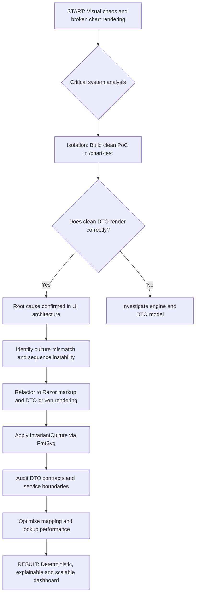
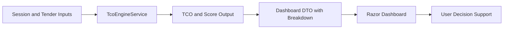

# REFACTORING LOG — From AI Chaos to Deterministic System Design

## Topic

Transformation of an unstable AI-generated TCO dashboard into a deterministic, testable and architecture-aligned decision-support component.

This document describes the debugging logic, architectural cleanup and future guardrails that must be followed by Cursor or any AI coding agent working on this project.

---

## 1. Problem Statement

During implementation of the visual TCO dashboard, the UI produced unstable rendering errors:

- diagonal text elements
- missing bars
- broken chart layout
- inconsistent SVG output
- UI behaviour that could not be trusted

A weak approach would have been to keep asking the AI to “fix the chart”.

That was rejected.

The issue was not treated as a cosmetic UI bug. It was treated as a system design problem.

### Critical observation

The data model was not the primary issue.

The root problem was located in the rendering architecture and formatting layer:

1. misuse of manual `RenderTreeBuilder` sequence numbers
2. culture mismatch between Danish decimal formatting and SVG/browser expectations
3. too much calculation/rendering responsibility leaking into UI code

In short:

> The engine was not necessarily broken. The UI layer was contaminated.


---

## 2. Isolation Before Repair

The existing dashboard code was considered polluted by technical debt.

Instead of continuing to patch the broken implementation, an isolated proof-of-concept was created:

`/chart-test`

The purpose was simple:

> Prove whether clean DTO input could render a correct chart in a clean environment.

### Logic

If a clean DTO could render correctly in isolation, then the data and decision model were usable.

If the isolated chart failed, the issue was deeper in the calculation or data model.

### Result

The `/chart-test` route rendered correctly.

This proved that the core model could support the visualisation, and that the main dashboard needed architectural sanitation rather than another cosmetic patch.


---

## 3. Root Cause Analysis

Two main technical causes were identified.

### 3.1 Sequence Instability

Manual C# rendering introduced unstable DOM output.

The problem was caused by fragile use of `RenderTreeBuilder` and sequence numbers, which made the UI difficult to reason about and easy for AI-generated patches to corrupt.

### Decision

Manual rendering was removed.

The chart was refactored to use clean Razor markup:

```razor
@foreach (var item in Model.Items)
{
    ...
}
```

### Reason

Razor markup is easier to inspect, test, maintain and constrain.

Cursor must not reintroduce manual `RenderTreeBuilder` logic for this dashboard unless there is a documented architectural reason.


---

### 3.2 Culture Mismatch

SVG attributes require invariant decimal formatting.

Danish culture formatting can produce commas:

```text
12,5
```

SVG/browser rendering expects dots:

```text
12.5
```

This created invalid or unpredictable SVG output.

### Decision

All SVG numeric attributes must be formatted through a dedicated invariant formatter:

```csharp
FmtSvg(value)
```

### Rule

Cursor must not write raw decimal/double values directly into SVG attributes.

Allowed:

```razor
width="@FmtSvg(bar.Width)"
x="@FmtSvg(bar.X)"
```

Not allowed:

```razor
width="@bar.Width"
x="@bar.X"
```


---

## 4. Architectural Refactoring

The dashboard was refactored around explicit DTO boundaries.

The UI should render already-prepared view data.

The UI should not own business logic, scoring logic, TCO calculations or supplier evaluation logic.

### Current architecture principle

```text
Session/Input
   ↓
TcoEngineService
   ↓
DTO with calculation breakdown
   ↓
Razor dashboard
```

The dashboard must be a consumer of decision output — not the place where the decision is calculated.

---

## 5. Decision Engine Logic

The goal was not simply to draw bars.

The goal was to make the dashboard support better tender decisions.

The visual layer must communicate:

- commercial impact
- technical fit
- regulatory cost/risk
- supplier decision score
- why a supplier is strong or weak

### Strategic visual logic

Supplier strategic fit is linked to visual emphasis.

Example:

> A supplier can be commercially attractive but strategically weak.

In that case, the supplier should not dominate the dashboard visually just because the price is low.

The visual model should help expose that risk.

### Example principle

```text
Low price + weak strategic score = visually reduced confidence
```

This makes the dashboard a decision-support tool, not just a chart.


---

## 6. Cursor Development Rules

Cursor must follow these rules when modifying the dashboard, TCO logic or DTO contracts.

### 6.1 Do not patch blindly

Before changing code, identify which layer owns the problem:

| Problem type | Correct owner |
|---|---|
| Wrong calculation | Service / engine |
| Wrong data shape | DTO / mapping |
| Wrong visual rendering | Razor component |
| Wrong browser formatting | Formatting helper |
| Wrong supplier interpretation | Scoring model |
| Slow rendering / repeated lookup | Data association / performance |

Do not solve engine problems in the UI.

Do not solve UI problems by changing domain logic.

---

### 6.2 Preserve separation of concerns

The following must remain separated:

| Layer | Responsibility |
|---|---|
| Domain / Engine | TCO, scoring, supplier evaluation |
| DTO | Stable contract between engine and UI |
| Razor UI | Render prepared data |
| Formatting helpers | Browser-safe output formatting |
| Tests / PoC | Prove deterministic behaviour |

Cursor must not move calculations into Razor loops.


---

### 6.3 Respect DTO Contract Stability

DTO changes are breaking changes.

Before changing any DTO used by the dashboard, Cursor must check:

- which UI pages consume it
- which services create it
- which tests depend on it
- whether existing mapping still works
- whether calculation breakdown is preserved

Any DTO change must include impact analysis.

No silent DTO mutation. Det er sådan man får lort i ventilatoren.

---

### 6.4 Maintain Explainability

Calculation output must remain explainable.

DTOs must preserve breakdown fields such as:

```csharp
CalculationBreakdown
ScoreBreakdown
CommercialScore
TechnicalScore
RegulatoryScore
TcoImpact
```

The user must be able to understand why a supplier receives a given score.

A dashboard that only shows a final number is not enough.


---

### 6.5 Keep Deterministic Rendering

Same input must produce same output.

No hidden UI side effects.

No random ordering.

No culture-dependent formatting.

No calculation drift inside rendering loops.

Required:

```text
same session + same supplier data + same settings = same dashboard result
```

---

### 6.6 Performance Is Part of Architecture

Performance is not an afterthought.

Core dashboard lookups must avoid repeated nested scans where possible.

Prefer O(n) association using dictionaries/lookups when matching:

- suppliers
- line evaluations
- score breakdowns
- calculation outputs
- dashboard items

Avoid accidental O(n²) logic in dashboard preparation.

If a change touches mapping or aggregation, Cursor must review lookup complexity.


---

## 7. Definition of Done — System Sanitization

| Principle | Status | Verification |
|---|---:|---|
| Separation of Concerns | ✅ | UI pages call services; no business math in Razor rendering loops |
| Single Responsibility | ✅ | `TcoEngineService.GetResults(session, suppliers)` owns spend/TCO/scoring logic |
| Testability | ✅ | `/chart-test` remains isolated PoC for deterministic rendering |
| Domain Modelling | ✅ | DTOs define stable boundaries between engine and UI |
| Deterministic Logic | ✅ | `FmtSvg` forces invariant formatting for SVG attributes |
| Explainability | ✅ | Calculation output includes breakdown fields |
| Idempotence | ✅ | Same inputs produce same result without UI side effects |
| Observability | ✅ | SVG tooltips explain score drivers via native `<title>` |
| Performance | ✅ | O(n) lookups implemented for audited mapping paths |
| Contract Stability | ✅ | DTO changes require UI impact review |

---

## 8. Final Status

The dashboard architecture has been audited, cleaned and performance-optimised.

Manual unstable rendering was replaced with deterministic Razor markup.

Culture-sensitive SVG formatting was isolated behind invariant formatting.

DTO boundaries were strengthened.

Decision logic was moved back into the engine/service layer.

The result is no longer just a visual dashboard.

It is a structured TCO decision-support component.


---

## 9. Mermaid — Refactoring Flow



---

## 10. Mermaid — Current Architecture



---

## 11. Cursor Instruction

When working on this area, Cursor must behave as an architecture assistant, not a patch generator.

Before changing code, Cursor must answer:

1. Which layer owns the problem?
2. Is the DTO contract affected?
3. Is rendering deterministic?
4. Is formatting browser-safe?
5. Is explainability preserved?
6. Is performance still acceptable?
7. Is the change testable in isolation?

If the answer is unclear, Cursor must stop and inspect before editing.

No random “try this fix”.

No UI magic.

No hidden calculations in markup.

No reintroducing `RenderTreeBuilder` unless explicitly justified.

The goal is simple:

> Robust decision-support architecture first.  
> Pretty dashboard second.  
> AI improvisation never.