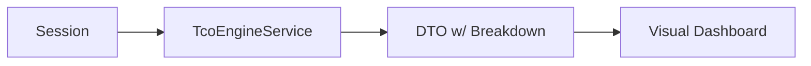

## Dokumentation af Fejlfinding og Arkitektonisk Sanering: REFACTORING

Emne: Fra AI-genereret kaos til deterministisk System Design

1. Problemanalyse (Det kritiske udgangspunkt)

Ved implementering af et visuelt TCO-dashboard genererede AI’en komplekse rendering-fejl (diagonale tekst-elementer og manglende barer). En ukritisk tilgang ville have været at bede AI’en om "flere fixes".

Kritisk observation: Jeg identificerede, at fejlen ikke lå i selve dataene, men i arkitekturen (misbrug af RenderTreeBuilder sekvensnumre) og kulturelle mismatch (decimal-komma vs. decimal-punktum i SVG).

1. Bevisførelse gennem Isolation (PoC)

For at isolere fejlen nægtede jeg at arbejde videre i den "forurenede" kode. Jeg tvang i stedet AI’en til at bygge en isoleret testbænk (/chart-test).

Logik: Hvis en isoleret DTO (Data Transfer Object) kunne rendere en graf korrekt i et rent miljø, var beviset ført: Motoren var rask, men den eksisterende UI-implementering var "forgiftet" af teknisk gæld.

Resultat: /chart-test leverede perfekte data, hvilket gav det nødvendige datagrundlag for en total sanering af hoveddashboardet.

1. Root Cause Analysis (De tekniske fund)

Gennem logisk deduktion fandt jeg frem til to fundamentale fejlårsager, som AI'en ikke selv kunne gennemskue:

Sequence Instability: Den manuelle C#-rendering mistede overblikket over DOM-id'er, hvilket skabte visuelle "spøgelser". Løsningen var en refactoring til ren Razor-markup (@foreach), hvilket flyttede kontrollen tilbage til systemets kerne.

Culture Mismatch: SVG-attributter (width/x/y) fejlede, fordi systemet brugte dansk decimalformat (komma). Ved at tvinge InvariantCulture (FmtSvg) sikrede jeg, at maskinen altid taler det korrekte sprog til browseren.

1. Strategisk Implementering (Value Chain Logic)

I stedet for blot at tegne barer, implementerede jeg en vægtet beslutningsmodel.

Implicit vs. Eksplicit logik: Jeg koblede leverandørens strategiske match (CTR-score) direkte til grafens gennemsigtighed (opacity).

##Resultat: En leverandør, der er billig, men strategisk risikabel, "fader" ud visuelt. Dashboardet gik fra at være et statisk billede til at være en Decision Engine, der sorterer og prioriterer data baseret på brugerens vægte.

##Konklusion (Den kritiske læring)
Dette forløb beviser, at AI er et værktøj, der kræver en System Specialist som arkitekt. Ved at anvende:

Isolation (Testbænk)

Dekonstruktion (Root Cause Analysis)

Syntese (DTO-baseret refactoring)

... lykkedes det at transformere et ustabilt output til en robust, skalerbar forretningsløsning. Det er ikke koden i sig selv, der er løsningen, men den logiske proces, der tvang koden til at lystre systemets krav.

graph TD
    A[START: Visuelt kaos & 404 fejl] --> B{Kritisk Analyse}
    B --> C[ISOLATION: Isoleret PoC i /chart-test]
    C --> D{Bevis ført?}
    D -- Ja --> E[IDENTIFIKATION: Culture Mismatch & Sequence Drift]
    E --> F[SANERING: DTO-model + InvariantCulture]
    F --> G[RESULTAT: 0 Warnings & Deterministisk UI]

```
style C fill:#f9f,stroke:#333,stroke-width:2px
style E fill:#ff9,stroke:#333,stroke-width:2px
style G fill:#9f9,stroke:#333,stroke-width:2px
```

---

## Definition of Done (System Sanitization)


| Principle           | Status | Verification                                                                                      |
| ------------------- | ------ | ------------------------------------------------------------------------------------------------- |
| SoC                 | ✅      | UI pages call services; no math in Razor rendering loops                                          |
| SRP                 | ✅      | `TcoEngineService.GetResults(session, suppliers)` owns spend/TCO/scoring logic                    |
| Testability         | ✅      | `/chart-test` remains isolated PoC for deterministic rendering                                    |
| Domain Modeling     | ✅      | DTOs (`LabelTenderDashboardDto`, `TcoDecisionOutput`, etc.) used as boundaries                    |
| Deterministic Logic | ✅      | `FmtSvg` forces `InvariantCulture` for SVG attributes                                             |
| DTOs                | ✅      | Calculation output includes `CalculationBreakdown` for explainability                             |
| Idempotence         | ✅      | Same session + inputs => same results (no UI side-effects); audited mapping uses O(n) association |
| Observability       | ✅      | SVG tooltips show “why this score” via native `<title>`                                           |


**Final status**: Architecture Audited & Performance Optimized (O(n) lookups implemented)

## Performance & Stability

- Performance is now a fixed audit dimension for core-logic changes (explicit **O(n)** focus).
- Contract-stability is enforced by always analyzing **breaking impact on UI** whenever DTO/data contracts change.




