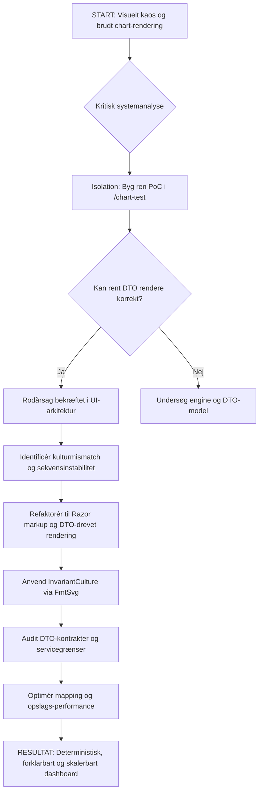
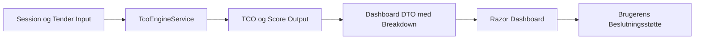

# Udviklingslog — PackagingTenderTool

<!-- AUDIENCE: Udvikler / Studerende | OWNER: docs/DEVELOPER_LOG.md -->
<!-- Formål: Teknisk dokumentation, læringsrefleksion og eksamensunderstøttelse -->

---

## Overblik

Dette dokument beskriver den tekniske og arkitektoniske rejse fra et ustabilt AI-genereret TCO-dashboard til et deterministisk, testbart og forklarbart beslutningsstøttesystem.

Dokumentet er struktureret i tre dele:

- **Del 1 — Kronologisk fortælling:** Hvad skete der, og hvad erkendte jeg undervejs
- **Del 2 — Tematisk analyse:** Hvilke tiltag blev anvendt, og hvilken teori understøtter dem
- **Del 3 — Personlig refleksion:** Hvad lærte jeg om AI-assisteret softwareudvikling

Målgruppen er mig selv som studerende, kommende eksaminator og fremtidige AI-agenter der arbejder på projektet.

---

# DEL 1 — Kronologisk fortælling

## 1. Udgangspunktet — hvad gik galt

Implementeringen af det visuelle TCO-dashboard producerede ustabile renderingsfejl:

- diagonale tekstelementer
- manglende søjler
- brudt chart-layout
- inkonsistent SVG-output
- UI-adfærd der ikke kunne stoles på

Den umiddelbare reaktion ville have været at bede AI om "flere fixes". Den tilgang blev afvist.

Problemet blev ikke behandlet som en kosmetisk UI-fejl. Det blev behandlet som et systemdesignproblem.

### Den første erkendelse

Datamodellen var ikke det primære problem.

Rodproblemet lå i rendering-arkitekturen og formateringslaget:

1. misbrug af manuelle `RenderTreeBuilder`-sekvensnumre
2. kulturmismatch mellem dansk decimalformatering og SVG/browser-forventninger
3. for meget beregnings- og renderingsansvar der var lækket ind i UI-koden

Kort sagt:

> Motoren var ikke nødvendigvis i stykker. UI-laget var forurenet.

Dette var en vigtig erkendelse. Det er let at antage at et synligt UI-problem skyldes forkerte data eller forkert beregning. Men i dette tilfælde var beregningslogikken korrekt — det var præsentationslaget der var arkitektonisk forgiftet af teknisk gæld.

---

## 2. Teknisk gæld opstår hurtigt — også med AI

Inden diagnosen var klar, var der allerede akkumuleret betydelig teknisk gæld.

Det overraskende var ikke at der opstod fejl. Det overraskende var *hastigheden* hvormed teknisk gæld akkumulerede i AI-assisteret udvikling.

En menneskelig udvikler bruger måske en time på at skrive 100 linjer problematisk kode. Med AI kan man producere 500 linjer på 10 minutter — inklusive arkitektoniske fejl der ikke er synlige ved første øjekast.

AI genererer plausibel kode. Ikke nødvendigvis korrekt kode.

I dette tilfælde havde AI introduceret:

- `RenderTreeBuilder`-logik der krævede præcis sekvensstyring som AI ikke kendte konteksten for
- inline decimal-formatering direkte i SVG-attributter uden hensyn til browserens kulturforventninger
- beregningslogik spredt mellem services og UI-komponenter

Ingen af disse fejl var åbenlyse. De så rigtige ud. De kompilerede. De virkede — indtil datamængden eller kulturindstillingen ændrede sig.

---

## 3. Isolation — beviset

I stedet for at fortsætte med at patch den eksisterende kode blev der bygget en isoleret proof-of-concept:

`/chart-test`

Formålet var enkelt:

> Bevis om rent DTO-input kan rendere et korrekt chart i et rent miljø.

### Logikken

Hvis et rent DTO kunne rendere korrekt i isolation, var data- og beslutningsmodellen brugbar.

Hvis den isolerede test fejlede, lå problemet dybere — i beregningen eller datamodellen.

### Resultatet

`/chart-test` renderede korrekt.

Dette beviste at kernemodellen kunne understøtte visualiseringen, og at hoveddashboardet krævede arkitektonisk sanering — ikke endnu et kosmetisk patch.

### Hvad isolation egentlig er

Isolation er ikke spild af tid. Det er den hurtigste vej til den rigtige diagnose.

Det er samme princip som en unit test: bevis én ting ad gangen. Eliminér støj. Gør bevisbyrden klar.

Uden isolation ville fejlsøgningen have fortsat i det forurenede miljø — og sandsynligvis produceret flere patches der flyttede problemet frem for at løse det.

---

## 4. Rodårsagsanalyse — de to tekniske fejl

### 4.1 Sekvensinstabilitet i RenderTreeBuilder

Manuel C#-rendering introducerede ustabilt DOM-output.

Problemet opstod ved brug af `RenderTreeBuilder` med sekvensnumre. `RenderTreeBuilder` kræver at sekvensnumre er stabile, unikke og korrekt ordnede på tværs af alle rendering-cyklusser. Hvis de ikke er det, mister Blazor overblikket over DOM-strukturen og producerer uforudsigelige visuelle resultater.

**Problemet med AI og RenderTreeBuilder:**
En AI-agent kender ikke den eksisterende sekvensnummerstruktur. Hver gang AI genererer ny rendering-kode, risikerer den at introducere konflikter. Det er ikke fordi AI er dum — det er fordi AI ikke har adgang til den implicitte tilstand som sekvenslogikken afhænger af.

**Beslutning:** Manuel rendering blev fjernet. Dashboardet blev refaktoreret til ren Razor markup:

```razor
@foreach (var item in Model.Items)
{
    <div class="bar" style="width: @FmtSvg(item.Width)px">...</div>
}
```

Razor markup er deklarativ. Den er lettere at inspicere, teste og begrænse. Og vigtigst: den er svær for en AI-agent at ødelægge ved en fejl, fordi strukturen er synlig og tydelig.

💡 Analogi — Lyskryds vs. rundkørsel
Med RenderTreeBuilder skulle du selv styre trafikken i et kæmpe lyskryds og give hvert køretøj et unikt nummer. Glemte du at omdøbe numrene når du indsatte et nyt, skabte du harmonika-sammenstød. AI'en var særlig dårlig til dette — den kom til at give forskellige ting det samme nummer. Med Razor @foreach har du bygget en rundkørsel. Trafikken flyder af sig selv, og ingen kan køre galt, fordi vejen er lagt på forhånd.

---

### 4.2 Kulturmismatch — dansk komma vs. SVG-punktum

SVG-attributter kræver invariant decimalformatering.

Dansk kulturindstilling kan producere:

```text
12,5
```

SVG/browser-rendering forventer:

```text
12.5
```

Dette skabte ugyldigt eller uforudsigeligt SVG-output — og det var præcis årsagen til de manglende søjler og den brudte chart-layout.

**Beslutning:** Al SVG-numerisk formatering blev isoleret bag en dedikeret invariant hjælpefunktion:

```csharp
FmtSvg(value)
```

**Reglen fremadrettet:**

Tilladt:
```razor
width="@FmtSvg(bar.Width)"
x="@FmtSvg(bar.X)"
```

Ikke tilladt:
```razor
width="@bar.Width"
x="@bar.X"
```

`FmtSvg()` gør reglen eksplicit og håndhævet. Det er ikke en konvention man skal huske — det er en struktur der tvinger korrekt adfærd.

💡 Analogi — USB-C vs. løse ledninger
Med løse ledninger skal du huske hvilken farve der er plus og minus. Glemmer du det, kortslutter du apparatet. Det er en konvention — en regel du skal huske i hovedet. FmtSvg() er USB-C-stikket: det er fysisk umuligt at tilslutte forkert. Du kan ikke "glemme" at bruge punktum i stedet for komma, fordi strukturen tvinger korrekt adfærd — uanset om det er dig eller en AI der skriver koden.

---

## 5. Refaktorering — hvad der blev bygget om

Dashboardet blev refaktoreret omkring eksplicitte DTO-grænser.

Arkitekturprincippet:

```
Session/Input
   ↓
TcoEngineService
   ↓
DTO med calculation breakdown
   ↓
Razor dashboard
```

UI skal rendere allerede forberedt view-data. UI skal ikke eje forretningslogik, scoringslogik, TCO-beregninger eller leverandørevaluering.

Dashboardet er en *forbruger* af beslutningsoutput — ikke det sted hvor beslutningen beregnes.

---

## 6. Resultatet — hvad systemet er nu

Det manuelle ustabile rendering blev erstattet med deterministisk Razor markup.

Kulturfølsom SVG-formatering blev isoleret bag invariant formatering.

DTO-grænser blev styrket.

Beslutningslogik blev flyttet tilbage til engine/service-laget.

Resultatet er ikke længere blot et visuelt dashboard.

Det er en struktureret TCO-beslutningsstøttekomponent.

### Den strategiske visuelle logik

Målet var ikke at tegne søjler. Målet var at støtte bedre indkøbsbeslutninger.

En leverandør kan være kommercielt attraktiv men strategisk svag. I det tilfælde bør leverandøren ikke dominere dashboardet visuelt blot fordi prisen er lav.

```text
Lav pris + svag strategisk score = visuelt reduceret confidence (opacity)
```

Dette gør dashboardet til et beslutningsstøtteværktøj — ikke blot et chart.

---

# DEL 2 — Tematisk analyse

## 7. Ingeniørbeslutninger og fravalg

Dette afsnit dokumenterer de vigtigste beslutninger — ikke blot hvad der blev valgt, men hvad der blev fravalgt og hvorfor.

---

### 7.1 Isolation frem for lapning

**Fravalgt:** At blive ved med at bede AI om fixes direkte i den eksisterende kode.

**Valgt:** Isoleret proof-of-concept (`/chart-test`) i et rent miljø.

**Hvorfor:** Hvis man lapper et system man ikke forstår, flytter man problemet — man løser det ikke. Isolation tvinger et præcist spørgsmål: er motoren i stykker, eller er UI-laget forurenet? Svaret kunne kun bevises gennem isolation.

---

### 7.2 Razor markup frem for RenderTreeBuilder

**Fravalgt:** At fortsætte med `RenderTreeBuilder` og forsøge at rette sekvensfejlene.

**Valgt:** Refaktorering til ren Razor `@foreach`-markup.

**Hvorfor:** `RenderTreeBuilder` kræver præcis manuel styring der er næsten umulig at styre for AI-agenter uden fuld kontekst. Razor markup er deklarativ, synlig og svær at ødelægge ved fejl.

---

### 7.3 Dedikeret formateringshjælper frem for inline formatering

**Fravalgt:** Inline formatering med `.ToString()` eller direkte interpolation i SVG-attributter.

**Valgt:** Dedikeret `FmtSvg()`-hjælper der tvinger `InvariantCulture`.

**Hvorfor:** Inline formatering er usynlig fejlrisiko. Næste udvikler — eller næste AI-session — vil ikke vide at der er en kulturafhængighed. `FmtSvg()` gør reglen eksplicit og håndhævet af strukturen, ikke af hukommelsen.

---

### 7.4 DTO-grænser frem for direkte servicekaldt fra UI

**Fravalgt:** At lade Razor-komponenter kalde services direkte og transformere data i rendering-loops.

**Valgt:** Stabile DTO-grænser (`LabelTenderDashboardDto`, `TcoDecisionOutput`, `CalculationBreakdown`) som eneste kontraktflade mellem motor og UI.

**Hvorfor:** Når UI-kode indeholder beregningslogik, er systemet umuligt at teste uden en browser. DTO-grænser er en firewall mod AI-drift: en AI-agent kan ændre en Razor-komponent uden at ødelægge beregningslogikken, fordi de er adskilt af en stabil kontrakt.

Det er sådan man undgår at få lort i ventilatoren.

💡 Analogi — Dorte Trøjgaard (tidligere chef)
En DTO er som Dorte. Dorte leverer præcis det hun har lovet — ikke mere, ikke mindre. Vil du have noget andet, skal I have en ny aftale. Du ringer ikke til Dorte og beder hende om at omstrukturere hele virksomheden mens hun er på vej med budgettet. En DTO er en pakke med færdige oplysninger — den beregner ikke, den beslutter ikke, den bare leverer. Og når Razor-koden kun må tale med Dorte (DTOen) og ikke direkte med motoren, er koden dum og stabil. Dum kode er god kode.

---

## 8. Teoretiske forbindelser

Dette afsnit kobler de praktiske beslutninger til etablerede softwareingeniørprincipper. Formålet er at vise at valgene ikke var tilfældige — de afspejler veldokumenterede principper fra softwarearkitektur og systemudvikling.

---

### 8.1 Separation of Concerns (SoC)

**Hvad det betyder i teorien:**
Et system skal opdeles så hver del kun har ansvar for ét klart defineret område. Beregning, præsentation og datahåndtering må ikke blandes.

**Hvad det betød i praksis:**
`TcoEngineService` ejer al TCO-matematik. Razor-komponenter renderer kun færdigberegnet output. `FmtSvg` ejer browserformatering. Ingen af disse ved noget om de andres interne logik.

**Hvorfor det er vigtigt:**
Når ansvarsområder er adskilt, kan fejl lokaliseres præcist. I dette projekt beviste isolation (`/chart-test`) at motoren var rask — problemet lå i UI-laget. Det var kun muligt at bevise fordi lagene var adskilt. Uden SoC ville debugging have været et gæt.

**Konsekvensen af brud:**
Når beregningslogik lækker ind i UI, opstår der fejl der ikke kan reproduceres uden en browser, ikke kan testes i isolation og ikke kan lokaliseres præcist. Det er præcis det der skete — og det er præcis derfor refaktoreringen var nødvendig.

💡 Analogi — Køkkenet, tjeneren og kasseapparatet
På en restaurant laver køkkenet maden, tjeneren serverer den, og kasseapparatet tager betaling. Ingen af dem laver hinandens arbejde. Hvis tjeneren begynder at lave mad, og kokken begynder at tage imod betaling, opstår der kaos — og når noget går galt, ved ingen hvem der er ansvarlig. SoC er restaurantens arbejdsdeling: TcoEngineService er køkkenet, DTOen er bakken tjeneren bærer, og Razor er borddækningen. Hver del ved præcis hvad den skal gøre — og ingenting andet.

---

### 8.2 Single Responsibility Principle (SRP)

**Hvad det betyder i teorien:**
En klasse eller komponent skal have ét og kun ét ansvar. Hvis den skal ændres, skal der kun være én årsag til at ændre den.

**Hvad det betød i praksis:**
`FmtSvg()` har ét ansvar: kultur-sikker SVG-formatering. `TcoEngineService` har ét ansvar: beregning og aggregering. `CalculationBreakdown` har ét ansvar: forklare hvorfor en score er som den er.

**Hvorfor det er vigtigt:**
SRP reducerer risikoen for at en ændring ét sted ødelægger noget et andet sted. I AI-assisteret udvikling er dette kritisk — en AI-agent der ændrer én fil bør ikke kunne ødelægge systemet andre steder. SRP er en arkitektonisk firewall mod ukontrolleret AI-drift.

**Konsekvensen af brud:**
Når én klasse har for mange ansvar, kan den ikke ændres sikkert. En AI-agent der "fikser" én ting i en klasse med mange ansvar risikerer at ødelægge noget andet i samme klasse — uden at vide det.

💡 Analogi — Schweizisk lommekniv vs. specialværktøj
En schweizisk lommekniv kan gøre mange ting — men den er ikke den bedste til noget af det. Vil du skrue en skrue fast professionelt, bruger du en rigtig skruetrækker. SRP siger: én klasse, ét ansvar. FmtSvg() er en specialiseret skruetrækker — den gør én ting perfekt. Hvis du bygger din kode som lommeknive der kan alt, ved du aldrig hvilken del der går galt når noget fejler. Og AI'en elsker at bygge lommeknive.

---

### 8.3 Kontraktbaseret design og DTO-stabilitet

**Hvad det betyder i teorien:**
Systemer kommunikerer via stabile kontrakter. En kontrakt definerer hvad der leveres — ikke hvordan. Ændringer i kontrakten er breaking changes der kræver eksplicit håndtering.

**Hvad det betød i praksis:**
DTOs (`LabelTenderDashboardDto`, `TcoDecisionOutput`) er kontrakten mellem motor og UI. De må ikke ændres stille og roligt. Enhver DTO-ændring kræver impact-analyse på alle forbrugere — hvilke UI-sider bruger den, hvilke services skaber den, hvilke tests afhænger af den.

**Hvorfor det er vigtigt:**
AI-agenter ændrer gerne DTOs for at løse et lokalt problem uden at forstå den globale konsekvens. En stabil kontrakt beskytter systemets integritet på tværs af sessioner og agenter. Det er ikke bureaukrati — det er den mekanisme der forhindrer stille regression.

💡 Analogi — Postmanden og pakken
En kontrakt er som en postordre. Du bestiller præcis det der står i kataloget — ikke hvad postmanden synes ville være bedre. Ændrer du kataloget uden at give kunderne besked, sender du forkerte pakker. En DTO-ændring er det samme: alle der har "bestilt" den eksisterende DTO skal orienteres — ellers modtager de noget de ikke kan bruge.

---

### 8.4 Isoleret testning og Proof of Concept

**Hvad det betyder i teorien:**
En test skal bevise én ting. En PoC skal besvare ét præcist spørgsmål. Isolation eliminerer støj og gør bevisbyrden klar.

**Hvad det betød i praksis:**
`/chart-test` besvarede ét spørgsmål: kan et rent DTO rendere korrekt i et rent miljø? Svaret var ja. Det beviste at problemet ikke lå i datamodellen — det lå i den forurenede UI-implementering.

**Hvorfor det er vigtigt:**
Uden en isoleret PoC ville man have fortsat med at patch det forkerte sted. Isolation er den hurtigste vej til den rigtige diagnose. Det er samme princip som en unit test — og det er derfor TDD er en naturlig forlængelse af denne tilgang.

💡 Analogi — Elektriker der tester et enkelt kabel
Forestil dig en elektriker der skal finde en fejl i et helt hus. Han kunne prøve at tænde alle kontakter på én gang og se hvad der sker. Eller han kunne isolere ét kabel ad gangen og teste det i et rent miljø. /chart-test var det isolerede kabel. Ikke fordi det var sjovere — men fordi det var den eneste måde at bevise præcis hvor fejlen sad. Isolation er ikke spild af tid. Det er den hurtigste vej til den rigtige diagnose.

---

### 8.5 Algoritmisk kompleksitet — O(n) frem for O(n²)

**Hvad det betyder i teorien:**
Når et system matcher data på tværs af lister, er det afgørende hvordan opslaget struktureres. Et nested loop der scanner en liste for hvert element er O(n²) — det skalerer katastrofalt med datamængden. Et dictionary-baseret opslag er O(n) — det skalerer lineært.

**Hvad det betød i praksis:**
Dashboard-forberedelsen bruger dictionary-baserede opslag til at matche leverandørdata, linjeevalueringer og scorebreakdowns. Det forhindrer at en tender med 200 linjer og 10 leverandører resulterer i 2.000 operationer i stedet for 210.

**Hvorfor det er vigtigt:**
Performance er en del af arkitekturen — ikke et eftertanke. Et dashboard der er korrekt men langsomt er ubrugeligt i produktion. En AI-agent der "løser" et rendering-problem ved at tilføje et nested loop har introduceret et arkitektonisk problem der ikke er synligt ved lav datamængde — men som kollapser ved reel brug.

💡 Analogi — Telefonbogen vs. at ringe til alle
Du skal finde "Jensen, Lars" i en telefonbog med 1.000 navne. O(n²) ville være at ringe til hvert navn og spørge: "Kender du Jensen, Lars? Og kender du ham? Og ham?" — én opringning per navn per navn. Det er 1.000.000 opringninger. O(n) er at slå op i registeret direkte — ét opslag, ét svar. I koden bruger vi dictionaries som et register. Når en tender har 200 linjer og 10 leverandører, er forskellen 210 operationer vs. 2.000. Det mærkes ikke ved 10 rækker. Det kollapser ved 10.000

---

## 9. Regler for fremtidige AI-agenter

Disse regler gælder for Cursor og enhver anden AI-agent der arbejder på dashboardet, TCO-logikken eller DTO-kontrakterne.

### Identificér laget før du ændrer

| Problemtype | Korrekt ejer |
|---|---|
| Forkert beregning | Service / engine |
| Forkert dataform | DTO / mapping |
| Forkert visuel rendering | Razor-komponent |
| Forkert browserformatering | Formateringshjælper |
| Forkert leverandørtolkning | Scoringsmodel |
| Langsom rendering | Data-association / performance |

Løs ikke engine-problemer i UI. Løs ikke UI-problemer ved at ændre domænelogik.

### Bevar laguafhængighed

| Lag | Ansvar |
|---|---|
| Domain / Engine | TCO, scoring, leverandørevaluering |
| DTO | Stabil kontrakt mellem engine og UI |
| Razor UI | Renderer forberedt data |
| Formateringshjælper | Browser-sikker outputformatering |
| Tests / PoC | Beviser deterministisk adfærd |

### Før du ændrer noget, svar på disse spørgsmål

1. Hvilket lag ejer problemet?
2. Er DTO-kontrakten påvirket?
3. Er rendering deterministisk?
4. Er formatering browser-sikker?
5. Er forklarbarhed bevaret?
6. Er performance stadig acceptabel?
7. Er ændringen testbar i isolation?

Hvis svaret er uklart — stop og inspicer før du redigerer.

Ingen tilfældige "prøv dette fix". Ingen UI-magi. Ingen skjulte beregninger i markup.

> Robust beslutningsstøttearkitektur først.
> Flot dashboard bagefter.
> AI-improvisation aldrig.

---

## 10. Definition of Done — Systemsanering

| Princip | Status | Verifikation |
|---|---|---|
| Separation of Concerns | ✅ | UI-sider kalder services — ingen forretningsmatematik i Razor rendering-loops |
| Single Responsibility | ✅ | `TcoEngineService.GetResults()` ejer spend/TCO/scoringslogik |
| Testbarhed | ✅ | `/chart-test` er isoleret PoC for deterministisk rendering |
| Domænemodellering | ✅ | DTOs definerer stabile grænser mellem engine og UI |
| Deterministisk logik | ✅ | `FmtSvg` tvinger invariant formatering for SVG-attributter |
| Forklarbarhed | ✅ | Beregningsoutput inkluderer breakdown-felter |
| Idempotens | ✅ | Samme input producerer samme resultat uden UI-sideeffekter |
| Observerbarhed | ✅ | SVG-tooltips forklarer score-drivere via native `<title>` |
| Performance | ✅ | O(n) opslag implementeret for auditerede mapping-stier |
| Kontrakt-stabilitet | ✅ | DTO-ændringer kræver UI impact-review |

---

## 11. Diagrammer

### Refaktoreringsflow



### Nuværende arkitektur



---

# DEL 3 — Personlig refleksion

## 12. Hvad overraskede mig mest?

Det mest overraskende var hvor hurtigt teknisk gæld akkumulerer i AI-assisteret udvikling — og at det sker *på trods af* at AI er med.

Den intuitive forventning er at AI hjælper med at undgå fejl. Den faktiske erfaring er den modsatte: AI gør det muligt at producere fejl hurtigere og i større skala.

En menneskelig udvikler bruger måske en time på at skrive 100 linjer teknisk gæld. Med AI kan man producere 500 linjer på 10 minutter — inklusive arkitektoniske fejl der ser rigtige ud, kompilerer og umiddelbart virker.

Det konkrete eksempel fra dette projekt: `RenderTreeBuilder`-problemet og kulturmismatch-fejlen opstod ikke fordi AI var dum. De opstod fordi AI ikke kendte systemets kontekst, arkitekturens regler eller de implicitte antagelser i den eksisterende kode.

**AI genererer plausibel kode — ikke nødvendigvis korrekt kode.**

Hastighed uden styring er ikke en fordel. Det er en accelerator for kaos.

💡 Analogi — Gæld på kreditkortet
Teknisk gæld fungerer præcis som gæld på et kreditkort. Du låner tid nu — "det fikser vi senere" — og betaler renter bagefter i form af bugs, refaktorering og debugging. AI gør det muligt at optage gæld 10 gange hurtigere end normalt. Du kan købe 500 linjer teknisk gæld på 10 minutter. Det ser fint ud på kontoudtoget i dag. Men renterne kommer — og de kommer med eskalationsrenter.

---

## 13. Hvad ville jeg gøre anderledes?

Jeg ville starte med strukturen frem for koden. Konkret:

### Spec-Driven Development (SDD) fra dag 1

Ingen kode før specifikationen er på plads. `spec.md` skal eksistere og være godkendt før en eneste linje domænelogik skrives. AI-agenten skal arbejde ud fra specifikationen — ikke opfinde sin egen fortolkning af hvad systemet skal gøre.

### `.cursorrules` som første fil i projektet

Ikke som en efterrationalisering når kaos er opstået — men som det første dokument der definerer spillereglerne. Arkitekturgrænser, navnekonventioner, forbudte mønstre og feedbackstruktur skal være på plads før AI-agenten skriver sin første linje.

### Separation of Concerns som arkitektonisk udgangspunkt

Definér lagene eksplicit fra starten: hvad ejer motoren, hvad ejer DTOs, hvad ejer UI. Skriv det ned. Giv det til AI-agenten som kontekst. En AI der kender lagstrukturen vil respektere den — en AI der ikke kender den vil blande det hele sammen.

### Test-Driven Development — stol aldrig blindt på AI-output

En AI-agent siger aldrig "jeg er usikker". Den producerer altid et svar der lyder overbevisende. TDD er den eneste måde at verificere at svaret faktisk er korrekt. Skriv testen først. Lad AI implementere. Kør testen. Gentag. *Never trust an AI.*

### Use case-modellering som fundament

Før systemet designes, skal use cases, aktører og flows dokumenteres eksplicit. Det er det abstraktionsniveau der tvinger én til at tænke i *hvad* systemet skal gøre — ikke i *hvordan* det skal implementeres.

Et godt eksempel på denne tilgang fra et andet projekt:

> *"Dokumentet kombinerer visuelle modeller — use case- og domænemodeller — med specifikke FURPS+ krav for at illustrere hvordan fysiske enheder interagerer med komplekse backend-systemer. Formålet er at skabe en enkel brugeroplevelse, mens systemet håndterer dataopsamling, fejlretning og logistik i baggrunden."*

Det er præcis den tilgang der manglede i starten af dette projekt. En use case tvinger én til at tænke i aktører, handlinger og systemgrænser — ikke i klasser og metoder. Det er det rigtige abstraktionsniveau at starte på.

💡 Analogi — Flyvemaskinens black box
En pilot stoler ikke blindt på at instrumenterne virker. Inden hver flyvning er der en tjekliste. TDD er programmørens tjekliste: skriv testen først (definer hvad der skal ske), lad AI implementere (start motoren), kør testen (tjek at instrumenterne peger rigtigt). En AI siger aldrig "jeg er usikker". Den producerer altid et svar der lyder overbevisende — ligesom et instrument der viser 1.000 meters højde selvom du flyver i 50. Testen er det eneste der beviser om svaret er korrekt.

---

## 14. Hvad dette fortæller om AI-assisteret softwareudvikling

Tre centrale erkendelser fra dette forløb:

### AI kræver domæneviden hos udvikleren

AI kan kode hvad den bliver bedt om. Men hvis udvikleren ikke ved hvad der skal kodes — og hvorfor — vil AI producere teknisk korrekt kode der løser det forkerte problem.

I dette projekt: AI kunne sagtens generere SVG-rendering. Men uden forståelse for at SVG kræver `InvariantCulture`, eller at `RenderTreeBuilder` kræver stabile sekvensnumre, producerede AI kode der så rigtig ud men var arkitektonisk forkert.

Man skal vide noget om domænet. Ellers koder AI hvad den *mener* er korrekt — ikke hvad der *er* korrekt.

💡 Analogi — En dygtig sekretær uden faglig viden
En AI er som en ekstremt dygtig sekretær der kan skrive hurtigt, formulere sig præcist og producere dokumenter på rekordtid. Men hvis du beder sekretæren om at skrive en juridisk kontrakt uden at fortælle hvad der skal stå — skriver hun noget der lyder juridisk korrekt men måske er fuldstændig forkert i sagen. AI koder hvad den tror du mener. Domæneviden er det du fortæller sekretæren inden hun begynder at skrive.

### AI kræver systematisk styring — ikke tillid

"Never trust an AI" er ikke en negativ holdning til teknologien. Det er en professionel tilgang til kvalitetssikring.

AI-output skal verificeres — gennem tests, code review og arkitektoniske guardrails. `.cursorrules` i dette projekt er et eksempel på systematisk styring: AI-agenten får eksplicitte regler for hvad der er tilladt og forbudt, ikke blot en åben invitation til at kode frit.

Grundigt forarbejde er ikke spild af tid. Det er forudsætningen for at AI-assisteret udvikling kan fungere uden at producere kaos.

### Kvalitetssikring af input er afgørende

Det gælder ikke kun for kode. Det gælder for alle data AI arbejder med.

Uden korrekte, validerede og veldefinerede input — hvad enten det er en specifikation, et Excel-ark eller en arkitekturgrænse — vil AI interpolere og gætte. Og AI gætter overbevisende. Det er præcis det der gør ukontrolleret AI-output farligt.

I PackagingTenderTool er Excel-importrobusthed et konkret eksempel: uensartede kolonnenavne, kulturafhængige talformater og manglende data får systemet til at fejle — ikke fordi motoren er forkert, men fordi inputdata ikke er kvalitetssikret tilstrækkeligt.

---

> AI er et værktøj der forstærker det du bringer til bordet.
>
> Bringer du struktur, forstærker AI struktur.
>
> Bringer du kaos, forstærker AI kaos.