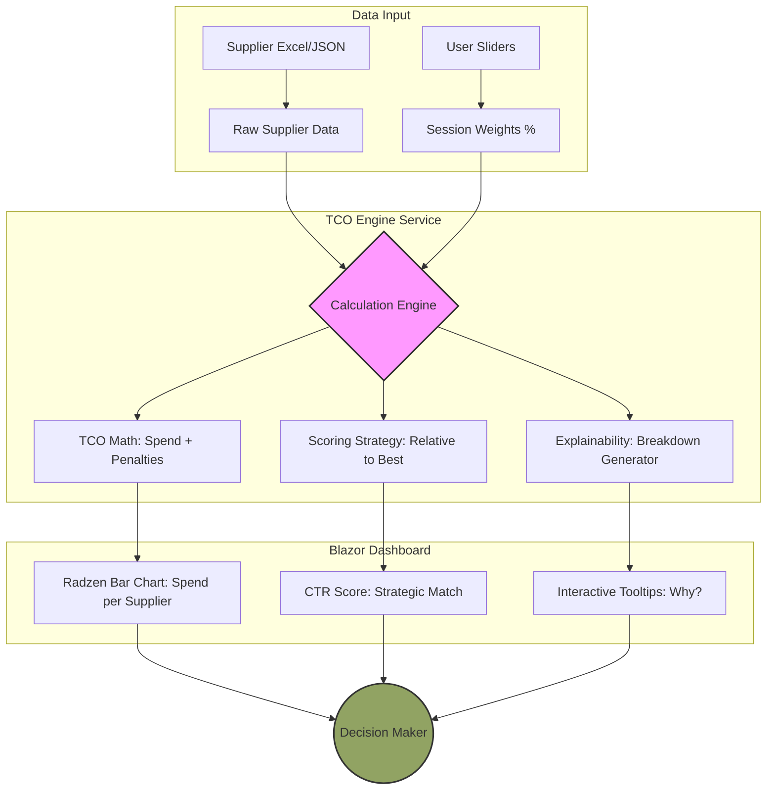

# PackagingTenderTool — System Specification

<!-- AUDIENCE: Developer / AI agent | OWNER: docs/spec.md -->
<!-- This is the canonical technical reference. Detail lives here. -->
<!-- Summary and orientation lives in docs/ARCHITECTURE.md. -->

---

## 1. Purpose

PackagingTenderTool is intended to support structured evaluation of packaging tenders in a way that is more reusable, transparent, and explainable than a spreadsheet-only process.

The solution transforms tender input data into:

- validated and normalised line data
- structured supplier evaluation
- analytics and summary outputs
- reusable frontend-ready models for UI presentation

Version 1 focuses on one packaging profile at a time, with Labels as the first supported profile.

---

## 2. System Architecture & Dataflow

The system follows a linear dataflow where the user's strategic weighting (Weights) and the factual supplier data (TCO) are merged in the calculation engine. Every visual change in the dashboard can be traced directly back to either a change in input data or an adjustment to the strategic prioritisation.



---

## 3. Version 1 Scope

Version 1 includes:

- one tender at a time
- one packaging profile per tender
- Labels as first packaging profile
- line-level evaluation
- supplier-level aggregation
- spend-weighted supplier comparison
- manual review handling
- Excel import for tender input — standard format and pivot format ("All labels DSH")
- validation and cleaning of imported data
- analytics outputs based on imported and cleaned data
- reusable output models for frontend use
- baseline price comparison (best bid baseline + current contract price)
- imputed spend for suppliers with incomplete bids

Version 1 does not include:

- multiple packaging profiles in the same tender
- final advanced scoring logic for all dimensions
- knockout / exclusion rules
- M3-based supplier identity

### Currency Handling

- one currency applies per tender
- currency does not vary by line
- default currency is configurable per tender
- supported currencies include EUR and NOK as examples
- currency conversion is out of scope for version 1

---

## 4. Frontend Direction

### Origin — WinForms prototype

The project started with a WinForms shell as a rapid way to get the engine running and verify core logic end-to-end. It served its purpose — import, evaluation, and supplier classification were all verified through WinForms. However, WinForms proved unsuitable for the actual product requirements: interactive chart rendering, real-time sliders, browser-based stakeholder access, and data-heavy dashboard composition all require a web-based framework.

WinForms is retained only as a minimal verification shell. No new development targets it.

### Current — Blazor cockpit with hybrid UI layer

The active frontend is Blazor with a deliberate three-way UI split (see ADR-006):

| Layer | Responsibility |
|-------|----------------|
| **MudBlazor** | App shell, navigation, snackbars, dialogs, polish |
| **Radzen 7.3.0** | Charts, grids, data-heavy cockpit views |
| **Custom PTDE CSS** | Brand identity, KPI-cards, colors, spacing |

This enables:

- real-time what-if weight sliders
- Radzen bar chart with reference lines for spend comparison
- interactive tooltips and explainability overlays
- browser-based access without local install
- bar chart click → deep-dive navigation pre-filtered to clicked supplier

Brand identity: Scandi Standard Green `#485230` / `#91A363`. No default MudBlazor blue in the cockpit shell.

---

## 5. Main Use Case

A user should be able to:

- create or open a tender context
- import Labels tender data from Excel (standard or pivot format)
- validate and parse the data
- identify invalid, missing, or suspicious data
- normalise the imported values
- evaluate tender data at line level
- aggregate results at supplier level
- calculate analytics and summary outputs
- adjust scoring weights via real-time sliders in the Blazor cockpit
- review supplier rankings with full score explainability
- compare supplier spend against best bid baseline and current contract price
- navigate from dashboard to deep-dive view per supplier
- select and deselect suppliers via sidebar checkbox list

---

## 6. Core Business Direction

- supplier evaluation starts at line level
- line-level results roll up to supplier level
- spend is the aggregation weight
- missing or invalid data triggers Manual Review — not automatic exclusion
- scoring must remain explainable
- decision support must be understandable both technically and commercially
- lowest price does not automatically win — regulatory and technical factors can and should outweigh short-term savings
- every number must be traceable — from KPI card to line item

---

## 7. Packaging Profile

### 7.1 Version 1 Profile

Version 1 supports Labels as the first and only packaging profile.

Additional profiles planned for future versions:

- trays
- cardboard
- other packaging formats

### 7.2 Profile Role

A packaging profile defines:

- relevant input fields
- validation rules
- scoring logic direction
- interpretation of technical and regulatory criteria

Each profile implements the Strategy Pattern interface. New profiles do not modify `TcoEngineService`.

---

## 8. Input Data

### 8.1 Input Source

Version 1 uses Excel as the primary input source for tender data. Two formats are supported:

**Standard format:** One row per supplier per item. Headers matched via alias lookup in `LabelsExcelImportService`. Robust to column name variations.

**Pivot format ("All labels DSH"):** One row per item, supplier prices in dedicated column blocks. Detected automatically by worksheet name. Processed by `PivotLabelsExcelImportService` which builds a synthetic standard-format workbook and feeds it to `LabelsExcelImportService`.

Pivot column layout (fixed, hardcoded — see ADR-007):

| Column | Field |
|--------|-------|
| A–J (1–10) | Item fields (item no, name, site, quantity, label size, winding, material, reel, colors, suggested MOQ) |
| K (11) | `current_price` — Scandi Standard's current contract price per 1,000 labels |
| L–N (12–14) | Flexoprint (price, MOQ, comment) |
| O–Q (15–17) | Norsk Etikett (price, MOQ, comment) |
| R–T (18–20) | Grafiket (price, MOQ, comment) |
| U–W (21–23) | Ettiketto (price, MOQ, comment) |

### 8.2 Expected Input Fields

The system supports structured tender rows with fields including:

- item number and item name
- supplier name
- site / country / business location
- quantity and spend
- price per 1,000 labels / unit price / theoretical spend values
- current contract price (`current_price`) — optional, used for deviation analysis
- label size
- material
- reel / roll information where relevant
- colour-related fields
- free-text comments

### 8.3 Revision Convention

Suppliers may submit multiple bid rounds. Revised bids follow this naming convention:

```
[SupplierName] Rev[N]
```

Examples: `Ettiketto Rev2`, `Flexoprint Rev3`

Revisions are treated as separate suppliers in the data model. The sidebar groups them under their base supplier name. The latest revision (highest N) is active by default after import.

### 8.4 Detail Rows vs Summary Rows

The import process must distinguish between:

- detailed tender rows (evaluation input)
- summary or report rows inside the same file (excluded from evaluation)

Summary blocks must not be treated as normal evaluation lines.

---

## 9. Import and Validation

### 9.1 Import Goals

The import layer must:

- read tender rows from Excel
- validate required columns
- validate field formats and datatypes
- parse rows into raw import models
- report issues clearly
- support a path from raw rows to cleaned domain rows

### 9.2 Import Result Reporting

The import result must report:

- rows imported / valid / invalid / skipped
- supplier count
- site count
- size count
- material count
- total spend where available

### 9.3 Data Quality Handling

Missing or invalid data must:

- trigger Manual Review where appropriate
- be captured as import issues
- not automatically exclude a supplier in version 1

### 9.4 Manual Review

Manual Review applies to:

- missing required values
- invalid values
- uncertain interpretation
- suspicious but non-blocking data patterns

Manual Review is a safety mechanism — not a final exclusion decision.

---

## 10. Data Layers

The solution keeps the following layers strictly separate.

### 10.1 Raw Import Data

Rows as read from the source file with minimal transformation. Preserves imported structure, supports diagnostics, isolates parsing concerns.

### 10.2 Cleaned / Normalised Domain Data

Validated and normalised business data used for scoring. Standardises values, reduces import format noise, provides consistent input to scoring and analytics.

### 10.3 Analytics / Summary Results

Aggregated outputs and decision-support metrics. Supports ranking, comparison, and insight generation.

### 10.4 Frontend-ready View Models

Reusable output structures bound to the Blazor/Radzen UI. Key types:

- `LabelTenderDashboardDto` — per-supplier TCO and score summary for dashboard
- `TcoDecisionOutput` — recommendation narrative and insight
- `ImputedSupplierSpend` — spend per supplier with incomplete-bid detection
- `BestBidBaseline` — `Dictionary<string, decimal>` (ItemNo → lowest unit price × quantity across all suppliers)
- `CurrentContractPriceBaseline` — `Dictionary<string, decimal>` (ItemNo → Scandi Standard's current contract price × quantity)

DTO contracts are stable — breaking changes require an explicit ADR and full UI impact analysis.

---

## 11. Normalisation Rules

Version 1 normalises where practical:

- label size values
- material names
- colour-related values
- number formats (including culture-safe decimal handling)
- spend and monetary fields
- price per 1,000 → unit price conversion (`PricePerThousand / 1000`)
- site / country naming where useful

Normalisation must be conservative, explainable, and testable. The system does not invent interpretations when source data is unclear.

---

## 12. Domain Model

The domain model supports the following concepts:

- `Tender`
- `TenderSettings`
- `PackagingProfile`
- `LabelLineItem` — includes `CurrentContractPrice` (decimal?, price per 1,000 labels)
- `Supplier`
- `LineEvaluation`
- `SupplierEvaluation`
- `ScoreBreakdown`
- `ManualReviewFlag`
- `TenderEvaluationResult` — includes `BestBidBaseline` and `CurrentContractPriceBaseline`

Supporting models include raw import row models, cleaned line item models, import summary / issue models, analytics summary models, and dashboard view models.

---

## 13. Evaluation Structure & Strategy Pattern

### 13.1 Strategy Pattern Enforcement

Evaluation is implemented using the Strategy Pattern. Each packaging profile provides its own implementation. Labels is the first profile.

- Every score is accompanied by a `CalculationBreakdown` explaining every deduction or bonus.
- Weights are read from `TenderSettings` to support real-time slider adjustments.
- No calculation logic lives in Razor components or view models.

### 13.2 Manual Review & Robustness

The engine is resilient to missing data:

- If a line lacks critical data, the engine does not return 0 for the entire dimension.
- The specific line is flagged with `ManualReviewFlag = True`.
- The supplier's aggregated result is marked `Status: Conditional`.

---

## 14. Scoring Logic & Formulas

### 14.1 Dynamic Weighting

The total score is a spend-weighted sum across three dimensions: Commercial, Technical, and Regulatory. Weights are adjustable via GUI sliders and always normalised to sum to 100.

Line score formula:

```
LS_i = (Score_Comm,i × W_Comm) + (Score_Tech,i × W_Tech) + (Score_Reg,i × W_Reg)
```

Weight invariant: `W_Comm + W_Tech + W_Reg = 100`

Weights are maintained deterministically — when one slider moves, the remainder is distributed proportionally across the other two.

### 14.2 Spend-Weighted Supplier Aggregation

```
S_total = Σ(LS_i × Spend_i) / Σ(Spend_i)
```

### 14.3 Baseline Price Comparison

Two reference baselines are computed automatically after import:

**BestBidBaseline:**
```
BestBidBaseline[ItemNo] = min(PricePerThousand / 1000 across all suppliers) × Quantity
```
Represents the theoretical minimum spend if the cheapest bid were chosen for every line.

**CurrentContractPriceBaseline:**
```
CurrentContractBaseline[ItemNo] = (current_price / 1000) × Quantity
```
Represents Scandi Standard's current contract spend per line. Null if `current_price` column absent.

Both baselines are exposed as reference lines on the dashboard bar chart.

### 14.4 Imputed Spend

Suppliers that have not bid on all lines receive imputed spend for missing lines:

```
ImputedSpend[supplier][itemNo] =
    CurrentContractPrice / 1000 × Quantity   (if current_price available)
    BestBidBaseline[itemNo]                   (fallback if no current_price)
    excluded                                   (if neither available)
```

Suppliers with imputed lines are flagged as "incomplete bid" in the UI.

### 14.5 Regulatory Dimension (PPWR & EPR)

Default weight: `W_Reg = 40` — highest of the three dimensions. Regulatory carries the highest weight because PPWR and EPR exposure creates direct financial risk for both supplier and buyer — not just a compliance checkbox.

#### 14.5.1 PPWR Recyclability Grades

| Grade | Recyclability | Score | Description |
|---|---|---|---|
| A | ≥95% | 100 | Fully recyclable. Monomaterial. Compatible with existing EU recycling. |
| B | ≥80% | 75 | High recyclability. Minor pre-treatment may be needed. |
| C | ≥70% | 50 | Recyclable with limitations. Some material loss or downcycling may occur. |
| D | 50–70% | 25 | Technically recyclable but not currently recycled at scale. |
| E | <50% | 0 | Non-recyclable or largely composite. |

#### 14.5.2 PPWR Grade Criteria

Five criteria determine a packaging item's recyclability grade:

- **Material composition** — monomaterials score higher. Laminates and composites score lower.
- **Design-for-recycling** — removable adhesives and caps improve grade. Metallic coatings reduce it.
- **Sorting compatibility** — must be detectable by NIR scanners in Material Recovery Facilities.
- **Recyclate quality** — high grades produce clean, reusable recyclate.
- **Recyclable mass share** — actual fraction recyclable under prevailing collection systems.

#### 14.5.3 PPWR Market Access Deadlines

| Year | Market Access Rule |
|---|---|
| Until 2029 | All grades A–E permitted |
| From 2030 | Only grades A, B, and C permitted |
| From 2035 | Must be "recyclable in practice and at scale" |
| From 2038 | Likely only grades A and B accepted |

#### 14.5.4 PPWR Risk Multiplier (active)

Static penalty applied to commercial spend (see ADR-PPWR):

| Grade | Penalty rate |
|-------|-------------|
| A | 0% |
| B | 0% |
| C | 5% |
| D | 15% |
| E | 25% |

Market access flags: `MarketAccessRisk2030` = true for grade D. `MarketAccessRiskNow` = true for grade E.

#### 14.5.5 EPR Fee Calculation

EPR calculation validates against country-specific rates for DK, SE, NO, FI, IE.

EPR grade factors applied in TCO: A=1.0, B=1.3, C=1.8, D=2.4, E=3.0 (fallback: 1.8)

```
EPR = EPRBase(country, weight, volume) × GradeFactor
```

### 14.6 Commercial Dimension

The lowest price for a line item sets the benchmark at 100 points:

```
Score_Comm,i = (Price_min,i / Price_current,i) × 100
```

### 14.7 TCO Formulas (Labels Cockpit)

```
Commercial  = V × P
EPR         = 0                                          (if PPWR scenario OFF)
EPR         = EPRBase(country, weight, V) × GradeFactor  (if PPWR scenario ON)
Switching   = 0                                          (if incumbent supplier)
Switching   = StartupCost + (MonthlySupportCost × 12)   (if new supplier)
MOQ         = Commercial × (MOQPenaltyPct / 100)

TCO_total   = Commercial + EPR + Switching + MOQ
```

Price score (relative to best):

```
PriceScore = clamp(TCO_min / TCO_total × 100, 0, 100)
```

Final CTR score:

```
CTR = clamp(((PriceScore × W_Comm) + (TechScore × W_Tech) + (RegScore × W_Reg)) / 100, 0, 100)
```

### 14.8 Explainability (CalculationBreakdown)

Each supplier row contains a `CalculationBreakdown` string answering:

- What penalty was applied? (PPWR/EPR, Switching, MOQ)
- What assumption was made? (e.g. zero-volume handling)
- What weights were active?

Surfaced via Radzen chart tooltips and in the deep-dive TCO breakdown section.

### 14.9 EPR Country Matrix

Supported countries: DK, SE, NO, FI, IE.

Core categories: Labels, Cardboard, Trays, Packaging Mixed, Flexibles.

```
EPR_cost = Weight_kg × Rate(category, country)
```

`EprFeeService` provides rate lookups. Missing rate combinations trigger `ManualReviewFlag`.

---

## 15. Supplier Classification

Classification states:

- `Recommended`
- `Conditional`
- `Manual Review`

Classification must always expose the reason. No black-box outcomes.

---

## 16. Analytics Outputs

The system supports:

- spend by supplier, country, site, material, size
- top spend items
- outlier candidates
- consolidation / standardisation candidates
- import issue summary
- manual review / flags summary

---

## 17. Planned Data Surfaces

Future Blazor screens supported by reusable models:

- Import summary
- Supplier overview (bar chart with baseline reference lines)
- Deep-dive: per-supplier line-level price analysis with deviation from best bid
- Country breakdown
- Site breakdown
- Material breakdown
- Item / detail table
- Flags / issues table

---

## 18. Filtering

A reusable filtering model supports filtering by:

- supplier (sidebar checkbox selector — select all / deselect all / individual)
- country, site, material, label size, winding, colors
- flagged only
- outliers only

Filters persist across tab navigation within a session.

---

## 19. Export

Export-ready outputs:

- cleaned data
- analytics summary
- flags / issues report

CSV is the initial format. Export logic is reusable and not coupled to any UI shell.

---

## 20. Demo / Synthetic Data

Synthetic suppliers for demonstration of non-Labels profiles (Trays, Cardboard, etc.):

- named `Fiktiv1`, `Fiktiv2`, `Fiktiv3`
- clearly synthetic
- based on realistic transformations of actual imported data patterns
- not random filler

For the Labels profile, real pivot-format tender files are used directly via `PivotLabelsExcelImportService`.

---

## 21. Non-Functional Requirements

The solution must be understandable, testable, explainable, reusable, and extensible for future packaging profiles.

Architecture priorities:

- separation of concerns
- reusable services
- controlled data flow
- no UI coupling in domain logic

---

## 22. Testing

Automated tests cover:

- domain model behaviour
- import and validation (standard and pivot format)
- cleaning and normalisation
- evaluation logic
- analytics outputs
- frontend-ready view model creation

Tests focus on business logic and reusable outputs — not fragile UI behaviour.

### Golden cases — always verify

1. Zero volume
2. Missing data / grades
3. Extreme scaling
4. PPWR toggles
5. Ranking stability

Reference: `tests/PackagingTenderTool.Core.Tests/GoldenCaseTests.cs`

---

## 23. Open Decisions

The following remain open and should be resolved incrementally:

- detailed technical scoring logic
- detailed material scoring logic
- classification thresholds
- knockout / exclusion rules (planned for v2 — see BACKLOG.md BACK-008)
- plausibility checks for suspicious supplier inputs
- exact supplier master-data identity strategy (M3 integration)
- deep-dive UI final design (in progress — BACK-028)
- revision side-by-side comparison UI (BACK-028)

---

## 24. Working Principles

These principles govern all implementation decisions. They apply equally to code, architecture, and documentation.

- start small and stable — prove it works before expanding it
- architecture before interface — services and domain logic before UI
- line-level logic before supplier-level summary visuals
- manual review before automatic exclusion — protect the buyer from hidden risk
- extensibility for future packaging profiles — Labels is profile 1, not the only profile
- every scoring dimension has a clear business explanation — no black-box scores
- reusable services before UI-specific implementation
- frontend preparation must not pollute domain logic
- regulatory scoring must be able to both increase and reduce score — it is not one-directional
- every number must be traceable — from KPI card to line item
- the tool must be understandable not only technically but also commercially and operationally

---

## 25. Summary

PackagingTenderTool version 1 is a Labels-focused tender evaluation solution built around:

- one tender at a time
- one packaging profile at a time
- line-level evaluation with spend-weighted supplier aggregation
- manual review instead of early exclusion
- 30/30/40 scoring direction (Commercial / Technical / Regulatory)
- import, validation, cleaning, and analytics pipeline
- baseline price comparison (best bid + current contract) with deviation display
- Blazor cockpit with hybrid UI (MudBlazor + Radzen + PTDE CSS)
- real-time what-if sliders and full audit trail
- bar chart dashboard with click-through to deep-dive per supplier

The specification supports implementation decisions that strengthen business value, explainability, reuse, and frontend readiness — not GUI cosmetics.