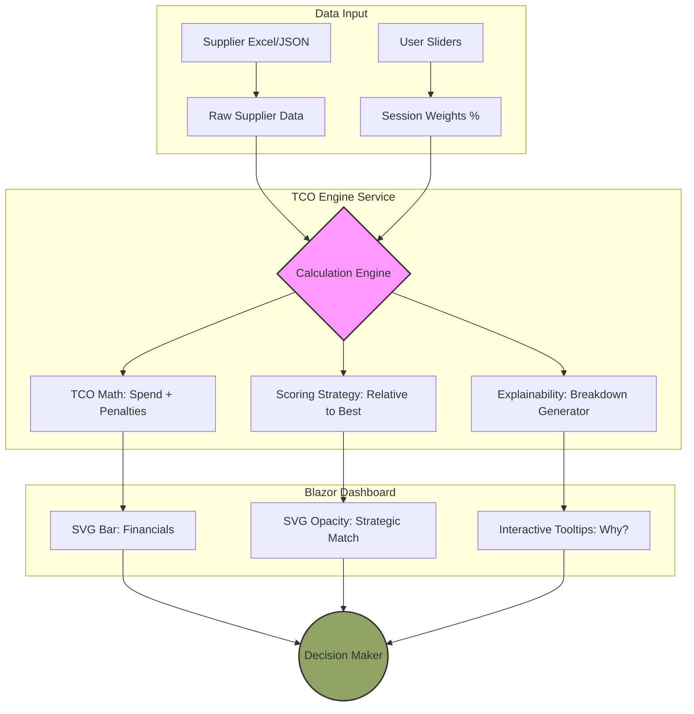

PackagingTenderTool Specification

1. Purpose

PackagingTenderTool is intended to support structured evaluation of packaging tenders in a way that is more reusable, transparent, and explainable than a spreadsheet-only process.

The solution should help transform tender input data into:

- validated and normalized line data
- structured supplier evaluation
- analytics and summary outputs
- reusable frontend-ready models for later UI presentation

Version 1 focuses on one packaging profile at a time, with Labels as the first supported profile.

1. System Architecture & Dataflow

For at sikre fuld gennemsigtighed i beslutningsprocessen følger systemet et lineært dataflow, hvor brugerens strategiske vægtning (Weights) og de faktuelle leverandørdata (TCO) smeltes sammen i beregningsmotoren.

Dette flow sikrer, at hver visuel ændring i dashboardet kan spores direkte tilbage til enten en ændring i input-data eller en justering af den strategiske prioritering.

1. Version 1 Scope

Version 1 includes:

- one tender at a time
- one packaging profile per tender
- Labels as first packaging profile
- line-level evaluation
- supplier-level aggregation
- spend-weighted supplier comparison
- manual review handling
- Excel import for tender input
- validation and cleaning of imported data
- analytics outputs based on imported and cleaned data
- reusable output models for future frontend use

Version 1 does not require:

- multiple packaging profiles in the same tender
- final advanced scoring logic for all dimensions
- knockout/exclusion rules
- M3-based supplier identity

1. Current Implementation Direction
  !-- UPDATED: Blazor is now the active frontend. WinForms is retired. -->

The current implementation direction is:

- WinForms is retained only as a minimal verification shell — no new development targets it
- Blazor with MudBlazor and Radzen is the active frontend (Decision Cockpit)
- core value is in reusable architecture: TcoEngineService, DTOs, Strategy Pattern
- prioritise business logic, import, analytics, filters, export, and frontend-ready models

Brand identity: Scandi Standard Green #91A363.

1. Main Use Case

A user should be able to:

- create or open a tender context
- import Labels tender data from Excel
- validate and parse the data
- identify invalid, missing, or suspicious data
- normalize the imported values
- evaluate tender data at line level
- aggregate results at supplier level
- calculate analytics and summary outputs
- adjust scoring weights via real-time sliders in the Blazor cockpit
- expose results in a form that can later be presented in a richer frontend

1. Core Business Direction

The business direction remains:

- supplier evaluation starts at line level
- line-level results roll up to supplier level
- spend is important in aggregation
- missing or invalid data should trigger Manual Review rather than early automatic exclusion
- scoring should remain explainable
- decision support must be understandable both technically and commercially

1. Packaging Profile

7.1 Version 1 Packaging Profile

Version 1 supports:

- Labels

Additional packaging profiles may be introduced later, such as:

- trays
- cardboard
- other packaging formats

7.2 Packaging Profile Role

A packaging profile defines:

- relevant input fields
- validation rules
- scoring logic direction
- interpretation of technical and regulatory criteria

1. Input Data

8.1 Input Source

Version 1 uses Excel input as the main source for tender data.

The uploaded tender file should be treated as the primary real-world data reference for the current development direction.

8.2 Expected Input Characteristics

The system should support structured tender rows with fields such as:

- item number
- item name
- supplier name
- site / country / business location where relevant
- quantity
- spend
- price / theoretical spend related values
- label size
- material
- reel / roll information where relevant
- color-related fields
- free-text comments where useful

Exact column names may vary and should be validated explicitly by the import layer.

8.3 Detail Rows vs Summary Rows

The import process must distinguish between:

- detailed tender rows
- summary or report rows inside the same file

Summary blocks must not be treated as normal evaluation lines unless explicitly used for validation or comparison purposes.

1. Import and Validation

9.1 Import Goals

The import layer should:

- read tender rows from Excel
- validate required columns
- validate field formats and datatypes
- parse rows into raw import models
- report issues clearly
- support a path from raw rows to cleaned domain rows

9.2 Import Result Requirements

The import result should support reporting of:

- rows imported
- valid rows
- invalid rows
- skipped rows
- supplier count
- site count
- size count
- material count
- total spend where relevant

9.3 Data Quality Handling

Missing or invalid data should:

- trigger Manual Review where appropriate
- be captured as import issues
- not automatically exclude a supplier in version 1 unless a later rule explicitly requires that

9.4 Manual Review

Manual Review should be used for:

- missing required values
- invalid values
- uncertain interpretation
- suspicious but non-blocking data patterns

Manual Review is intended as a safety mechanism, not as a final decision on supplier exclusion.

1. Data Layers

The solution should keep the following data layers distinct.

10.1 Raw Import Data

Represents rows as read from the source file with minimal transformation.

Purpose:

- preserve imported structure
- support diagnostics
- isolate parsing concerns

10.2 Cleaned / Normalized Domain Data

Represents validated and normalized business data used for evaluation.

Purpose:

- standardize values
- reduce noise from import format differences
- provide consistent input to scoring and analytics

10.3 Analytics / Summary Results

Represents aggregated outputs and decision-support metrics.

Purpose:

- support ranking, comparison, and insight generation
- support later export and presentation

10.4 Frontend-ready View Models

Represents reusable output structures that later can be bound to a Blazor/Radzen UI.

Purpose:

- avoid coupling analytics directly to WinForms
- support later dashboard, table, and filter views

1. Normalization Rules

Version 1 should normalize where practical:

- label size values
- material names
- color-related values
- number formats
- spend and monetary fields
- site/country naming where useful

Normalization should be:

- conservative
- explainable
- testable

The system should not aggressively invent interpretations when source data is unclear.

1. Domain Model Direction

The domain model should support at least the following concepts:

- Tender
- TenderSettings
- PackagingProfile
- LabelLineItem
- Supplier
- LineEvaluation
- SupplierEvaluation
- ScoreBreakdown
- ManualReviewFlag
- TenderEvaluationResult

Supporting or adjacent models may include:

- raw import row models
- cleaned line item models
- import summary / issue models
- analytics summary models
- dashboard / output view models

The exact class design may evolve, but the responsibility boundaries should remain clear.

1. Evaluation Structure & Strategy

13.1 Strategy Pattern Enforcement

Evaluation must be implemented using the Strategy Pattern. Each packaging profile (starting with Labels) must provide its own implementation of evaluation logic.

- Explainability: Every score must be accompanied by a logic-container that explains the deduction or bonus.
- GUI Readiness: Calculation weights must be read from TenderSettings to support real-time slider adjustments (1-100) in the frontend.

13.2 Manual Review & Robustness

The engine must be resilient to missing data to avoid "all-or-nothing" results:

- If a line lacks critical data (e.g., price or material info), the engine must not return a 0 score for the entire dimension.
- Instead, the specific line is flagged with ManualReviewFlag = True.
- The supplier's aggregated result is marked with Status: Conditional, allowing users to drill down and identify missing data points.

1. Scoring Logic & Formula

14.1 Dynamic Weighting (Slider-Ready)

The total score is a weighted sum of three dimensions: Commercial, Technical, and Regulatory. Weights (W) are adjustable via the GUI but must always be normalized.

Line Score Formula: For each line (i), a LineScore (LS) is calculated:

LS_i = (Score_Comm,i × W_Comm) + (Score_Tech,i × W_Tech) + (Score_Reg,i × W_Reg)

14.1.1 Implemented What-If Weight Normalization (Deterministic)

In the current Labels cockpit implementation, weights are treated as linked sliders (Commercial/Technical/Regulatory) and are maintained to always sum to 100% by deterministically distributing the remainder across the two non-primary pillars (proportional to their prior ratio).

Effective invariant: W_Comm + W_Tech + W_Reg = 100

14.2 Spend-Weighted Supplier Aggregation

To determine a supplier's total score (S_total), each line score is weighted by its relative Spend:

S_total = Σ(LS_i × Spend_i) / Σ(Spend_i)

14.3 Regulatory Dimension (PPWR & EPR)

Regulatory criteria are weighted highest by default (W_Reg = 40).

- PPWR (A-E): Linear mapping from grade to points: Grade A: 100 pts | Grade B: 75 pts | Grade C: 50 pts | Grade D: 25 pts | Grade E: 0 pts.
- EPR (Scandi Focus): Calculation must validate against country-specific rates for DK, SE, NO, FI, IE.
- Risk Flagging: High-risk materials (e.g., multi-laminates in high-EPR fee countries) must trigger a "High Cost Risk" flag.

14.4 Commercial Dimension

- Price Benchmarking: The lowest price in the tender for a specific line item sets the benchmark (100 pts).
- Relative Scoring: Other prices are scored relative to the benchmark: Score_Comm,i = (Price_min,i / Price_current,i) × 100

14.5 Implemented TCO Formulas (Labels cockpit)

The Labels dashboard uses supplier-level TCO components and a derived price-score.

Base quantities:

- V = volume (labels), derived from supplier quantity (if V ≤ 0, treated as 0)
- P = price per label

TCO components:

- Commercial: Commercial = V × P
- Regulatory (EPR):
  - If PPWR scenario is OFF: EPR = 0
  - If PPWR scenario is ON: EPR = EPRBase(country, weight, V) × GradeFactor
  - Grade factors: A=1.0, B=1.3, C=1.8, D=2.4, E=3.0 (fallback defaults to C-like 1.8)
- Switching:
  - If supplier is incumbent: Switching = 0
  - Else: Switching = StartupCost + (MonthlySupportCost × 12)
- MOQ risk: MOQ = Commercial × (MOQPenaltyPct / 100)

Total: TCO_total = Commercial + EPR + Switching + MOQ

Price score (relative to best total): Let TCO_min be the minimum TCO_total among current suppliers (floor of 1 to avoid divide-by-zero).

PriceScore = clamp(TCO_min / TCO_total × 100, 0, 100)

Final CTR score (weighted): Weights are session-driven (W_Comm, W_Tech, W_Reg) and sum to 100:

CTR = clamp(((PriceScore × W_Comm) + (TechScore × W_Tech) + (RegScore × W_Reg)) / 100, 0, 100)

Visual cue mapping: Opacity = max(0.25, CTR / 100)

14.6 Explainability (CalculationBreakdown)

Each supplier row contains a CalculationBreakdown string that answers:

- What penalty? (PPWR/EPR, Switching, MOQ)
- What assumption? (e.g., zero-volume cases)
- What weights were active? (Commercial/Technical/Regulatory % from the session)

The UI surfaces this via native SVG tooltips () on each supplier bar group.

14.7 EPR Country Matrix & Fee Calculation

Supported countries: DK, SE, NO, FI, IE. Core categories: Labels, Cardboard, Trays, Packaging Mixed, Flexibles.

Calculation logic: EPR_cost = Weight_kg × Rate(category, country)

The EprFeeService provides rate lookups. If a rate is missing for a specific country/category combination, the system must trigger a ManualReviewFlag.

1. Classification Direction

Supplier classification should remain explainable and may include states such as:

- Recommended
- Conditional
- Manual Review

Classification should never hide the reasons behind the outcome.

1. Analytics Outputs

The system should support analytics such as:

- spend by supplier
- spend by country
- spend by site
- spend by material
- spend by size
- top spend items
- outlier candidates
- consolidation / standardization candidates
- import issue summary
- manual review / flags summary

1. Planned Data Surfaces / Future Screens

The following output surfaces should be supportable by reusable models:

- Import summary
- Supplier overview
- Country breakdown
- Site breakdown
- Material breakdown
- Item/detail table
- Flags/issues table

1. Filtering Direction

A reusable filtering model should support future filtering by:

- supplier
- country
- site
- material
- size
- flagged only
- outliers only

1. Export Direction

The solution should support export-ready outputs for:

- cleaned data
- analytics summary
- flags/issues report

CSV is sufficient as an initial practical direction. Export logic should be reusable and not tightly coupled to any UI shell.

1. Demo / Synthetic Data

If synthetic suppliers are required for demonstration:

- they may be named Fiktiv1, Fiktiv2, Fiktiv3
- they must be clearly synthetic
- they should be based on realistic transformations of actual imported data patterns
- they should not be random filler disconnected from the real structure

1. Non-Functional Requirements

The solution should be:

- understandable
- testable
- explainable
- reusable
- extensible for future packaging profiles
- robust enough for inconsistent tender input
- suitable for further UI evolution

The architecture should prioritise:

- separation of concerns
- reusable services
- controlled data flow
- limited UI coupling

1. Testing Direction

Automated tests should continue to cover:

- domain model behavior
- import and validation
- cleaning and normalization
- evaluation logic
- analytics outputs
- frontend-ready view-model creation

Testing should remain focused on business logic and reusable outputs rather than fragile UI-specific behavior.

Golden cases that must always pass:

1. Zero volume
2. Missing data / grades
3. Extreme scaling
4. PPWR toggles
5. Ranking stability

Reference: tests/PackagingTenderTool.Core.Tests/GoldenCaseTests.cs

1. Open Decisions

The following remain open:

- detailed price scoring formula
- detailed technical scoring logic
- detailed material scoring logic
- classification thresholds
- knockout / exclusion rules
- plausibility checks for suspicious inputs
- exact supplier master-data identity strategy
- exact future Blazor navigation/layout composition

1. Summary

PackagingTenderTool version 1 is a Labels-focused tender evaluation solution built around:

- one tender at a time
- one packaging profile at a time
- line-level evaluation
- spend-weighted supplier aggregation
- manual review instead of early exclusion
- 30/30/40 scoring direction
- import, validation, cleaning, and analytics
- Blazor cockpit with real-time what-if sliders and full audit trail

The specification should continue to support implementation decisions that strengthen business value, explainability, reuse, and frontend readiness.